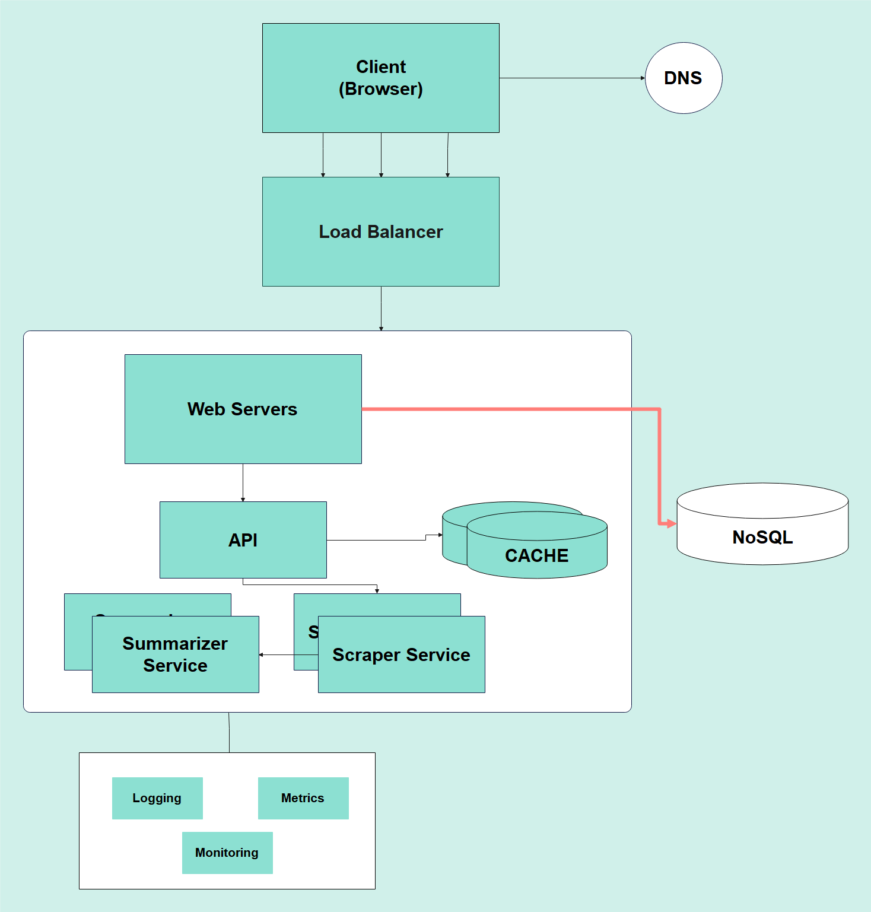

# HyperCrawl-X

HyperCrawl-X is an advanced AI-Enhanced Web Scraping tool designed for developers who need fast, reliable, and insightful data extraction. Powered by cutting-edge AI technologies, HyperCrawl-X enables real-time performance tracking and deep analysis of scraped data.

## Description

HyperCrawl-X addresses the challenges of modern web scraping with an AI-driven approach. It efficiently scrapes data from diverse websites and processes it in real-time to generate actionable insights. Built with a modular architecture, HyperCrawl-X integrates seamlessly with various technologies, ensuring smooth deployment and scalability.

## Why HyperCrawl-X?

The digital landscape is vast, and extracting meaningful data from the web requires more than just a simple scraping tool. HyperCrawl-X was created to overcome the limitations of traditional scraping methods, offering a solution that is both fast and intelligent. Whether working with low-memory devices or managing large-scale scraping operations, HyperCrawl-X delivers efficiency and precision.

### Key Features:

- **Fast Web Scraping**: Handles high volumes of data with minimal latency.
- **AI-Powered Insights**: Provides deep analysis and understanding of scraped content.

## System Architecture

This architecture ensures a clean separation of concerns, which makes the system more maintainable, scalable, and testable.



## Product Highlights

### Home Page:


### Results:


## Quick Start

To set up and start using HyperCrawl-X:

1. **Clone the repository:**
   ```bash
   git clone https://github.com/ishaksebsib/hypercrawl-x.git
   ```
2. **Navigate to the project directory:**
   ```bash
   cd hypercrawl-x
   ```
3. **Navigate to both the backend and frontend directories:**
   ```bash
   cd backend
   cd frontend
   ```
   For each directory, follow the steps below:
   1. **Install dependencies :**
      ```bash
      npm install
      npm run dev
      ```
   2. **Run the application: (Development)**
      ```bash
      npm run dev
      ```

## Tech Stack

| **Category**   | **Technologies**                                                                     |
| -------------- | ------------------------------------------------------------------------------------ |
| **Backend**    | Node.js / Express.js, Transformers.js, Puppeteer, MongoDB, Swagger, Zod, Pino Logger |
| **Frontend**   | React/NextJS (Typescript), TailwindCSS, ShadcnUI, Axios                              |
| **CI/CD**      | GitHub Actions                                                                       |
| **Analytics**  | Google Analytics, Prometheus                                                         |
| **Deployment** | Render (Backend), Docker                                                             |
| **Testing**    | Jest, Playwright (E2E)                                                               |
