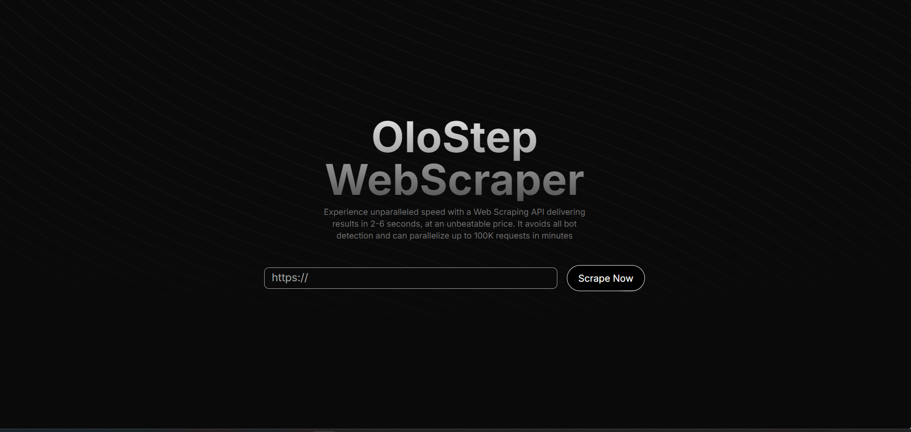

# HyperCrawl-X

HyperCrawl-X is an advanced AI-Enhanced Web Scraping tool designed for developers who need fast, reliable, and insightful data extraction. Powered by cutting-edge AI technologies, HyperCrawl-X enables real-time performance tracking and deep analysis of scraped data.

## Why HyperCrawl-X?

The digital landscape is vast, and extracting meaningful data from the web requires more than just a simple scraping tool. HyperCrawl-X was created to overcome the limitations of traditional scraping methods, offering a solution that is both fast and intelligent.

### Key Features:

- **Fast Web Scraping**: Handles high volumes of data with minimal latency.
- **AI-Powered Insights**: Provides deep analysis and understanding of scraped content.

## System Architecture

This architecture ensures a clean separation of concerns, which makes the system more maintainable, scalable, and testable.


## Product Highlights

### Home Page:



### Results:


### [LIVE LINK](https://hypercrawl-x.vercel.app/)
### [API Documentation (Swagger)](https://hypercrawl-x.onrender.com/)

## Quick Start

To set up and start using HyperCrawl-X:

1. **Clone the repository:**
   ```bash
   git clone https://github.com/ishaksebsib/hypercrawl-x.git
   ```
2. **Navigate to the project directory:**
   ```bash
   cd hypercrawl-x
   ```
3. **Navigate to both the backend and frontend directories:**
   ```bash
   cd backend
   cd frontend
   ```
   For each directory, follow the steps below:
   1. **Install dependencies :**
      ```bash
      npm install
      npm run dev
      ```
   2. **Run the application: (Development)**
      ```bash
      npm run dev
      ```

## Tech Stack

| **Category**   | **Technologies**                                                                     |
| -------------- | ------------------------------------------------------------------------------------ |
| **Backend**    | Node.js / Express.js (Typescript), Transformers.js, Puppeteer, MongoDB, Swagger, Zod, Pino Logger |
| **Frontend**   | React/NextJS (Typescript), TailwindCSS, ShadcnUI, Axios                              |
| **CI/CD**      | GitHub Actions                                                                       |
| **Analytics**  | Google Analytics, Prometheus                                                         |
| **Deployment** | Render (Backend), Docker                                                             |
| **Testing**    | Jest, Playwright (E2E)                                                               |


## Project Structure

The project is organized into a clear and modular folder structure to ensure maintainability, scalability, and ease of collaboration. Below is a breakdown of the key directories and their contents:

## `Backend/`
This directory contains all the server-side logic and API implementations.

- **biome.json**: Configuration file for the project environment.
- **Dockerfile**: Instructions to create a Docker image for the backend service.
- **.github/workflows/**: Contains CI/CD pipeline configurations specific to the backend.
- **src/**: Source code for the backend, organized as follows:
  - **api/**: Contains API endpoint implementations.
    - **healthCheck/**: Health check API to monitor the service status.
    - **scrape/**: Web scraping related API controllers, models, and routes (MVC).
  - **api-docs/**: Scripts and tests for generating and managing API documentation.
  - **common/**: Shared utilities, middlewares, and models used across the backend.
  - **db.ts**: Database connection and setup logic.
  - **index.ts**: Entry point for the backend service.
  - **server.ts**: Main server configuration and initialization.

- **tsconfig.json**: TypeScript configuration for the backend.
- **vite.config.mts**: Configuration for Vite, a build tool used in the project.

## `Frontend/`
This directory houses the client-side application, developed using modern web technologies.

- **app/**: Main application directory containing global styles and layout components.
- **components/**: Reusable UI components and sections used across the frontend.
- **components.json**: Configuration file for managing frontend components.
- **lib/**: Utility functions and API interactions for the frontend.
- **public/**: Static assets such as images and icons.
- **tailwind.config.ts**: Tailwind CSS configuration file.
- **tsconfig.json**: TypeScript configuration for the frontend.


## **Contributing**

I would love your help! Contribute by forking the repo and opening pull requests. Please ensure that your code passes the existing tests and linting, and write tests to test your changes if applicable.

All pull requests should be submitted to the  `main`  branch.
